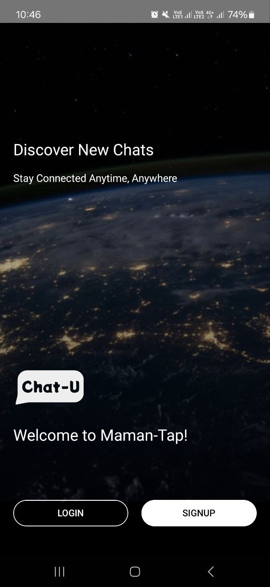
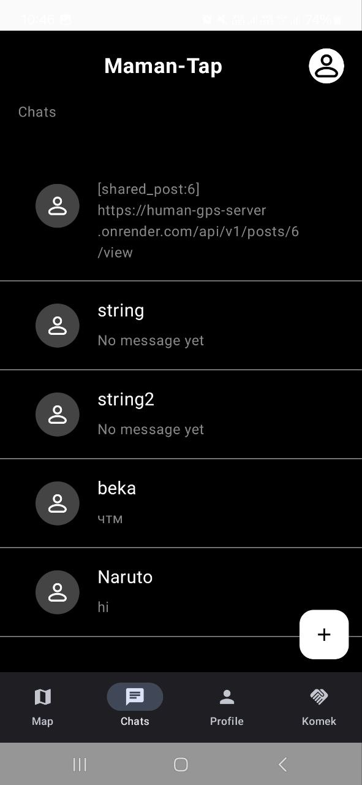
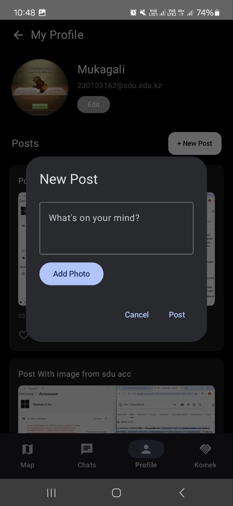
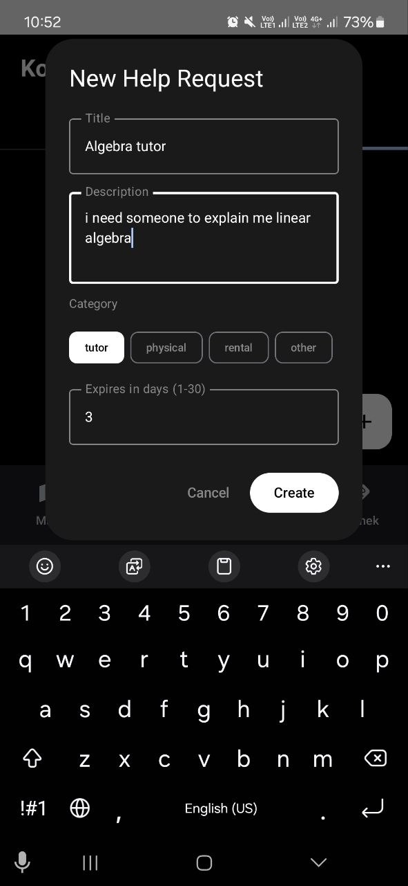
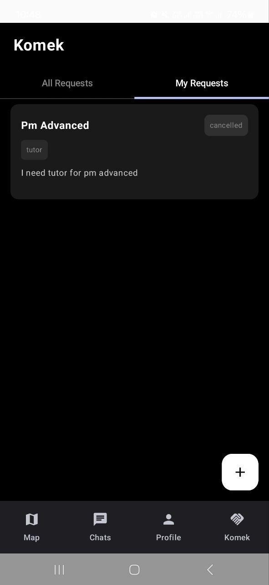
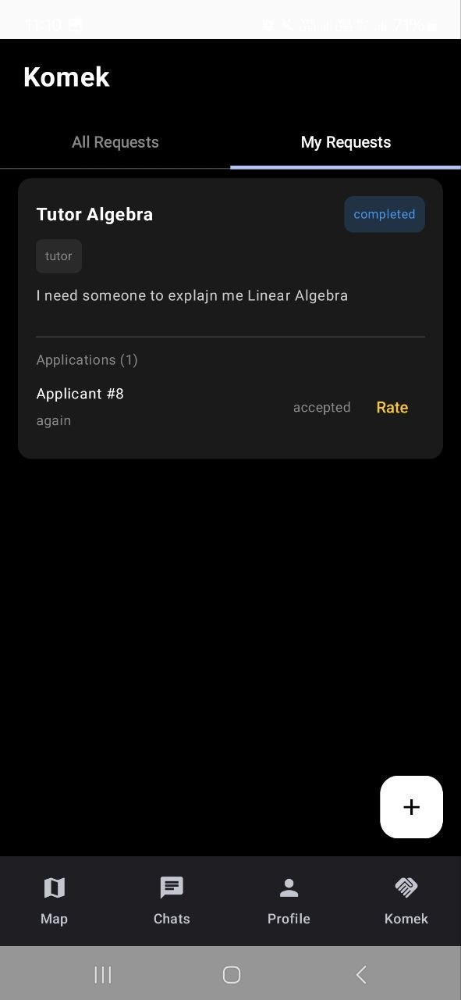
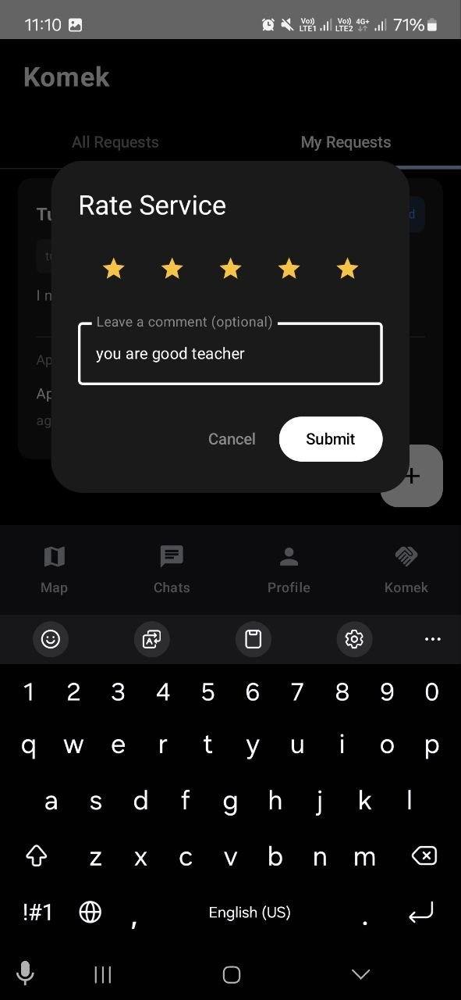
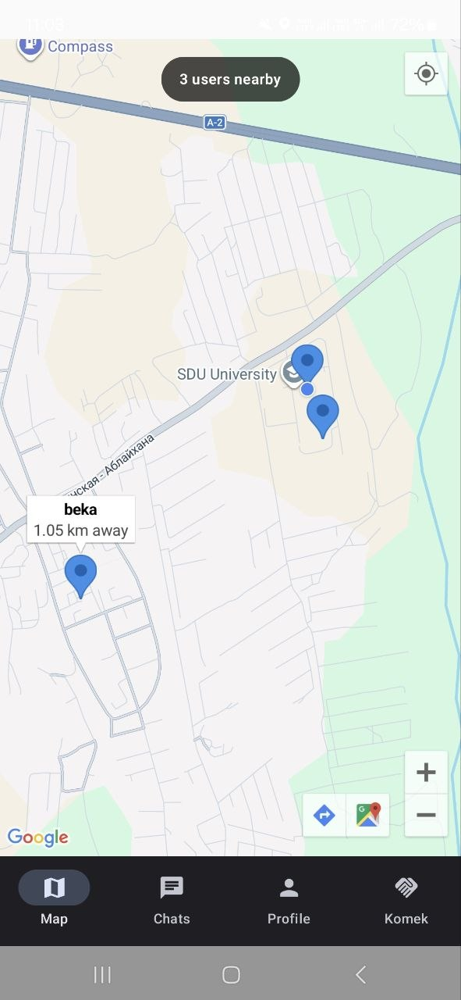

# Maman-Tap 

> A community-driven social platform for connecting people, sharing posts, and requesting help — built with FastAPI and Kotlin.

---

## Problem Statement

In many communities, people struggle to find help nearby or connect with others around them. Maman-Tap solves this by providing a mobile-first platform where users can post updates, chat with each other, request or offer help, and discover people near their location — all in one place.

---

## Features

### Backend (FastAPI)
- **Authentication** — JWT-based login/signup with access & refresh tokens, token blocklist via Redis, email verification, password reset
- **Role-Based Access Control** — user/admin roles with `RoleChecker` dependency
- **Posts** — create, read, update, delete posts with image upload (Cloudinary), likes, comments, shares
- **Direct Messaging** — one-on-one conversations with message history
- **Komek (Help Requests)** — post help requests by category (tutor, physical, rental, other), apply to help others, accept/reject applications
- **Location Services** — update user location, discover nearby users within a radius using Haversine formula
- **AI Image Moderation** — automatic content moderation via Sightengine API; flags and bans users who post inappropriate content
- **Email Notifications** — email confirmation and password reset via Gmail SMTP
- **Rate Limiting** — per-IP request throttling with slowapi (write endpoints limited separately from reads)

### Android (Kotlin)
- **User Profile** — view and edit profile, upload profile image
- **Posts Feed** — browse, create, and interact with posts
- **Direct Chat** — real-time one-on-one messaging
- **Komek** — browse and post help requests in the community
- **Nearby Map** — discover users near your location using Google Maps SDK

---

## Technology Stack

| Layer | Technology |
|---|---|
| **Mobile** | Kotlin (Android) |
| **Backend** | FastAPI (Python) |
| **Database** | PostgreSQL via Neon DB (cloud) |
| **ORM** | SQLModel + SQLAlchemy (async) |
| **Background Tasks** | Celery |
| **Message Broker** | Redis (Redis Labs cloud / local) |
| **Image Storage** | Cloudinary |
| **Image Moderation** | Sightengine API |
| **Email** | Gmail SMTP via fastapi-mail |
| **Authentication** | JWT (PyJWT) + bcrypt |
| **Rate Limiting** | slowapi |
| **Profiling** | pyinstrument |
| **Maps (Android)** | Google Cloud Console Maps SDK |
| **DB Migrations** | Alembic |
| **Deployment** | Render (API + Celery worker) |

---

## Demo

<p align="center">
  
  
  
  
</p>

<p align="center">
  
  
  
  
</p>

## Installation

### Prerequisites
- Python 3.10+
- Android Studio (for mobile)

### Backend — Local without Docker

# 1. Create virtual environment
python -m venv .venv
source .venv/bin/activate  # Windows: .venv\Scripts\activate

# 2. Install dependencies
pip install -r requirements.txt

# 3. Set up .env file

# Fill in DATABASE_URL, REDIS_URL, JWT_SECRET, etc.

# 4. Run migrations
alembic upgrade head

# 5. Start FastAPI
uvicorn src:app --reload

# 6. Start Celery worker (separate terminal)
python -m celery -A src.celery worker --loglevel=INFO --pool=solo

### Environment Variables

```env
# Database
DATABASE_URL=postgresql+asyncpg://...

# Redis
REDIS_URL=redis://...

# JWT
JWT_SECRET=
JWT_ALGORITHM=HS256
REFRESH_TOKEN_EXPIRY=7

# Cloudinary
CLOUDINARY_CLOUD_NAME=
CLOUDINARY_API_KEY=
CLOUDINARY_API_SECRET=

# Email (Gmail App Password)
MAIL_USERNAME=your@gmail.com
MAIL_PASSWORD=xxxx xxxx xxxx xxxx
MAIL_FROM=your@gmail.com
MAIL_PORT=587
MAIL_SERVER=smtp.gmail.com
MAIL_FROM_NAME=Maman-Tap

# Sightengine (Image Moderation)
SIGHTENGINE_API_USER=
SIGHTENGINE_API_SECRET=
```
---

---

## Background Tasks

| Task | Trigger | Description |
|---|---|---|
| `send_confirmation_email` | Signup with verification | Sends email verification link |
| `send_password_reset_email` | Forgot password | Sends password reset link |
| `compress_and_store_image` | Profile image upload | Compresses image, stores binary in PostgreSQL |
| `moderate_image` | Post with image | AI content check; flags post + bans user if inappropriate |
| `moderate_profile_image` | Profile image upload | AI content check; removes image + bans user if inappropriate |

---

## Architecture

```
Android App (Kotlin)
       │
       ▼ HTTP/REST
FastAPI Backend ──── PostgreSQL (Neon DB)
       │
       ├──── Redis (rate limiting + JWT blocklist + Celery broker)
       │
       └──── Celery Worker
                ├── Email tasks (Gmail SMTP)
                └── Image moderation (Sightengine API → ban user)
```

---

## Deployment

The backend is deployed on **Render** using two services from the same GitHub repository:

- **Web Service** — FastAPI app
  - Build: `pip install -r requirements.txt`
  - Start: `uvicorn src:app --host 0.0.0.0 --port $PORT`

- **Web Service (Celery)** — Background worker
  - Build: `pip install -r requirements.txt`
  - Start: `python -m celery -A src.celery worker --loglevel=INFO --pool=solo`

External services: **Neon DB** (PostgreSQL) + **Redis Labs** (Redis)
